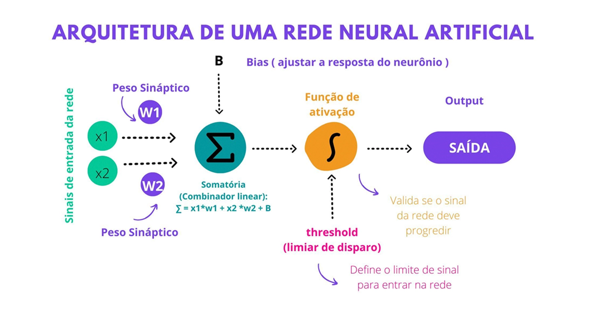
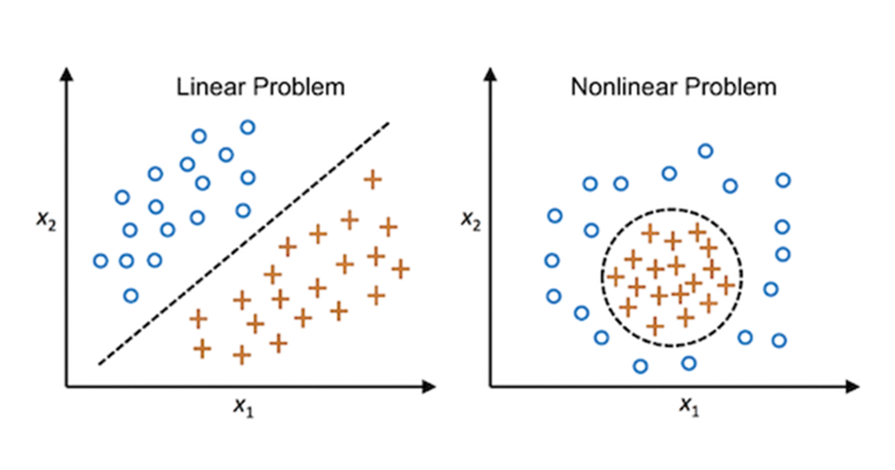

# 🤖 Copy of Aula 1 | Perceptron de múltiplas camadas


<details>

<summary><span data-gb-custom-inline data-tag="emoji" data-code="1f5c3">🗃️</span> Arquivos de Aula</summary>

:file\_cabinet: [**Repositório**](https://github.com/camimq/deep\_learning\_and\_unstructured\_data)

:notebook\_with\_decorative\_cover: [**Conteúdo**](https://drive.google.com/file/d/13\_4FySHDx-OyN7QBFRU64zmA1uw8S9W7/view?usp=sharing)

</details>

## Entendendo o neurônio Perceptron

<figure><figcaption><p>Imagem proposta por Frank Rosenblatt, para explicar o comportamento no neurônio Perceptron</p></figcaption></figure>

**Passo a passo:**

1. **Sinais de Entrada (x1, x2)**:
   * São os dados que alimentam a rede neural. No exemplo, temos dois sinais de entrada: ( x1 ) e ( x2 ).\

2. **Pesos Sinápticos (W1, W2)**:
   * Cada entrada é multiplicada por um peso sináptico. Esses pesos determinam a importância de cada entrada. No exemplo, temos ( W1 ) e ( W2 ).\

3. **Combinação Linear**:
   * As entradas ponderadas são somadas junto com um valor de bias (B). A fórmula é: \[ y = x1 \cdot W1 + x2 \cdot W2 + B ]
   * O bias ajusta a resposta do neurônio, permitindo que o modelo se ajuste melhor aos dados.\

4. **Função de Ativação**:
   * A soma ponderada passa por uma função de ativação, que decide se o neurônio deve ser ativado ou não. A função de ativação pode ser, por exemplo, a função sigmoide, ReLU, entre outras.\

5. **Saída (Output)**:
   * Se o valor após a função de ativação ultrapassar um certo limiar (threshold), o neurônio é ativado e gera uma saída.

#### Explicação Didática das Fórmulas:

* **Combinação Linear**: \[ y = x1 \cdot W1 + x2 \cdot W2 + B ]
  * **x1, x2**: Entradas da rede.
  * **W1, W2**: Pesos associados às entradas.
  * **B**: Bias, que ajusta a resposta do neurônio.\

* **Função de Ativação**:
  * Pode ser representada por várias funções matemáticas, como a sigmoide: \[ \sigma(y) = \frac{1}{1 + e^{-y\}} ]
  * Ou a ReLU (Rectified Linear Unit): \[ \text{ReLU}(y) = \max(0, y) ]

***

Podemos listar algumas características desse modelo de Perceptron:

* O modelo possui um natureza **binária (0 e 1)**. Tanto os sinais de entrada, quanto a saida, são valores binários. O Perceptron é um **classificador linear (binário)**.
* Os **pesos** da rede neural podem ser **ajustáveis**, inspirados em sinapses, podendo ser excitatórias ou inibitórias (positivos ou negativos).
* É utilizado na **aprendizagem supervisionada** e pode ser usado para classificar os dados de entrada fornecidos.
* Classifica a entrada separada duas categorias com uma linha reta.

O Perceptron segue o modelo _**feed-foward**_. Nesse tipo de modelo, as entradas da rede são enviadas para o neurônio, em seguida são processadas e resultam em uma saída. Um único Perceptron pode resolver problemas lineares, a questão é que os dados do mundo real **não são lineares**, fazendo com que esse tipo de neurônio artificial não seja muito útil para solucionar problemas não lineares.

<figure><figcaption></figcaption></figure>

### Redes Neurais Multicamadas

Podemos considerar as redes neurais multicamadas como um aprendizado supervisionado diferente do Perceptron. Uma rede neural multicamadas constrói várias camadas ocultas, modelando assim a correlação (ou dependências) entre os dados de entrada com os de saída. O seu treinamento envolve o ajuste dos parâmetros, ou pesos e bias do modelo, para minimizar o erro.

Basicamente, seu funcionamento consiste no algoritmo alimentar cada instância de treinamento para a rede calcular a saída de cada neurônio em cada camada consecutiva. em seguida, ele **mede o erro de saída da rede** (isto é, a diferença entre a saída desejada e a saída real da rede) e **calcula o quanto cada neurônio contribuiu para o erro** de cada neurônio de saída na última camada oculta. Como próximo passo, o modelo passa a medir a quantidade dessas contribuições de erro provenientes de cada neurônio na camada oculta anterior, e assim por diante, até o algoritmo alcançar a camada de entrada. Esta passagem reversa (também conhecida como **backpropagation**) mede a **eficiência do gradiente de erro em todos os pesos de conexão da rede**.

<figure><figcaption></figcaption></figure>

## Detalhamento do código da aula

### Classificando diferentes tipos de sementes de abóbora

As sementes de abóbora são frequentemente consumidas como confeitos em todo o mundo devido à sua quantidade adequada de proteínas, gorduras, carboidratos e teores minerais. A base de dados **"SementesAbobora.xlsx"** possui um estudo foi realizado nos dois tipos de sementes de abóbora mais importantes e de qualidade, **“Ürgüp Sivrisi”** e **“Çerçevelik”**, geralmente cultivadas nas regiões de Ürgüp e Karacaören na Turquia.

Muitas espécies de sementes têm semelhanças visuais, o que torna a classificação manual difícil e sujeita a erros. Redes neurais podem ser treinadas para identificar padrões que não são facilmente perceptíveis pelo olho humano, aumentando a precisão da classificação.

Imagine que foi proposto para você o desafio de criar uma **inteligência para identificar os tipos de sementes para ajudar a equipe de engenheiros e engenheiras Agrícolas**. Para trabalhar com a precisão dos resultados x complexidade das características de sementes, você optou em utilizar as **redes neurais multilayer perceptron**. Vamos para a aplicação?

#### Features

* Perímetro
* Maior\_Eixo\_Comprimento
* Comprimento\_Eixo\_Menor
* Área\_Convexa
* Equiv\_Diâmetro
* Excentricidade
* Solidez
* Extensão
* Redondeza
* Proporcao
* Compacidade

#### Target

Classes: ((A)Çerçevelik, (B)Ürgüp Sivrisi)

#### Análise de correlação

````python
```python
from sklearn.preprocessing import LabelEncoder

le = LabelEncoder()
df['Class'] = le.fit_transform(df['Class'])
correlation_matrix = df.corr().round(2)

fig, ax = plt.subplots(figsize=(15,10))
sns.heatmap(data=correlation_matrix, annot=True, linewidths=.5, ax=ax)
```
````

ste trecho de código realiza as seguintes operações no conjunto de dados armazedo no [`df`](https://vscode-file/vscode-app/c:/Users/Elitebook/AppData/Local/Programs/Microsoft%20VS%20Code/resources/app/out/vs/code/electron-sandbox/workbench/workbench.html):

1. **Importação de Módulos**: Importa o [`LabelEncoder`](https://vscode-file/vscode-app/c:/Users/Elitebook/AppData/Local/Programs/Microsoft%20VS%20Code/resources/app/out/vs/code/electron-sandbox/workbench/workbench.html) da biblioteca [`sklearn.preprocessing`](https://vscode-file/vscode-app/c:/Users/Elitebook/AppData/Local/Programs/Microsoft%20VS%20Code/resources/app/out/vs/code/electron-sandbox/workbench/workbench.html), que é usado para converter rótulos de texto em valores numéricos discretos.\

2. **Codificação de Rótulos**: Utiliza o [`LabelEncoder`](https://vscode-file/vscode-app/c:/Users/Elitebook/AppData/Local/Programs/Microsoft%20VS%20Code/resources/app/out/vs/code/electron-sandbox/workbench/workbench.html) para transformar os rótulos na coluna `'Class'` do DataFrame [`df`](https://vscode-file/vscode-app/c:/Users/Elitebook/AppData/Local/Programs/Microsoft%20VS%20Code/resources/app/out/vs/code/electron-sandbox/workbench/workbench.html) de strings (ou qualquer outro tipo de rótulo textual) para valores inteiros. Isso é útil para modelos de _machine learning_ que requerem entradas numéricas.\

3. **Cálculo da Matriz de Correlação**: Calcula a matriz de correlação para todas as colunas numéricas do DataFrame [`df`](https://vscode-file/vscode-app/c:/Users/Elitebook/AppData/Local/Programs/Microsoft%20VS%20Code/resources/app/out/vs/code/electron-sandbox/workbench/workbench.html) usando o método `.corr()`. A matriz de correlação é arredondada para duas casas decimais com `.round(2)`. A matriz de correlação mostra como as variáveis estão relacionadas entre si, com valores variando de -1 a 1, onde 1 significa correlação perfeita positiva, -1 significa correlação perfeita negativa, e 0 significa que não há correlação.\

4. **Visualização da Matriz de Correlação**: Cria uma visualização da matriz de correlação usando a biblioteca `matplotlib` (para criar a figura e os eixos) e a biblioteca `seaborn` (para criar um mapa de calor). O mapa de calor mostra a matriz de correlação com:
   * Tamanho da figura ajustado para 15x10.
   * Anotações ativadas para mostrar os valores de correlação nas células do mapa de calor.
   * Linhas de grade ([`linewidths=.5`](https://vscode-file/vscode-app/c:/Users/Elitebook/AppData/Local/Programs/Microsoft%20VS%20Code/resources/app/out/vs/code/electron-sandbox/workbench/workbench.html)) para separar as células.

<figure><figcaption></figcaption></figure>

#### Tratando a variável _target_

````python
```python
# Utilizadno Label Enconder
from sklearn.preprocessing import LabelEncoder
le = LabelEncoder()
df.Class = le.fit_transform(df['Class'])
```
````

Este trecho de código realiza a codificação de rótulos (labels) de texto para valores numéricos na coluna `Class`  do DataFrame ([`df`](https://vscode-file/vscode-app/c:/Users/Elitebook/AppData/Local/Programs/Microsoft%20VS%20Code/resources/app/out/vs/code/electron-sandbox/workbench/workbench.html)`)` usando a classe [`LabelEncoder`](https://vscode-file/vscode-app/c:/Users/Elitebook/AppData/Local/Programs/Microsoft%20VS%20Code/resources/app/out/vs/code/electron-sandbox/workbench/workbench.html) da biblioteca [`sklearn.preprocessing`](https://vscode-file/vscode-app/c:/Users/Elitebook/AppData/Local/Programs/Microsoft%20VS%20Code/resources/app/out/vs/code/electron-sandbox/workbench/workbench.html):

1. **Importação da Classe  `LabelEncoder`**: Importa a classe [`LabelEncoder`](https://vscode-file/vscode-app/c:/Users/Elitebook/AppData/Local/Programs/Microsoft%20VS%20Code/resources/app/out/vs/code/electron-sandbox/workbench/workbench.html) do módulo [`sklearn.preprocessing`](https://vscode-file/vscode-app/c:/Users/Elitebook/AppData/Local/Programs/Microsoft%20VS%20Code/resources/app/out/vs/code/electron-sandbox/workbench/workbench.html), que é uma ferramenta para converter rótulos de texto em valores numéricos incrementais (0, 1, 2, ...).\

2. **Criação de uma Instância de `LabelEncoder`**: Cria um objeto [`le`](https://vscode-file/vscode-app/c:/Users/Elitebook/AppData/Local/Programs/Microsoft%20VS%20Code/resources/app/out/vs/code/electron-sandbox/workbench/workbench.html) que é uma instância da classe [`LabelEncoder`](https://vscode-file/vscode-app/c:/Users/Elitebook/AppData/Local/Programs/Microsoft%20VS%20Code/resources/app/out/vs/code/electron-sandbox/workbench/workbench.html).\

3. **Transformação dos Rótulos da Coluna `Class`**: Utiliza o método [`fit_transform`](https://vscode-file/vscode-app/c:/Users/Elitebook/AppData/Local/Programs/Microsoft%20VS%20Code/resources/app/out/vs/code/electron-sandbox/workbench/workbench.html) do objeto [`le`](https://vscode-file/vscode-app/c:/Users/Elitebook/AppData/Local/Programs/Microsoft%20VS%20Code/resources/app/out/vs/code/electron-sandbox/workbench/workbench.html) para ajustar o codificador aos rótulos de texto na coluna `Class` do DataFrame ([`df`](https://vscode-file/vscode-app/c:/Users/Elitebook/AppData/Local/Programs/Microsoft%20VS%20Code/resources/app/out/vs/code/electron-sandbox/workbench/workbench.html)) e, em seguida, transformá-los em valores numéricos. O resultado dessa transformação substitui os valores originais da coluna `Class` no DataFrame ([`df`](https://vscode-file/vscode-app/c:/Users/Elitebook/AppData/Local/Programs/Microsoft%20VS%20Code/resources/app/out/vs/code/electron-sandbox/workbench/workbench.html)).

Essencialmente, este código converte categorias textuais em valores numéricos, o que é uma prática comum em machine learning para preparar dados categóricos para algoritmos que requerem entrada numérica.

#### Separando os dados

````python
```python
from sklearn.model_selection import train_test_split
X_train, X_test, y_train, y_test = train_test_split(X, y, test_size=0.20)
```
````

Utiliza a biblioteca [`sklearn`](https://vscode-file/vscode-app/c:/Users/Elitebook/AppData/Local/Programs/Microsoft%20VS%20Code/resources/app/out/vs/code/electron-sandbox/workbench/workbench.html) para dividir um conjunto de dados em subconjuntos de treinamento e teste:&#x20;

1. **Importação da função** [**`train_test_split`**](https://vscode-file/vscode-app/c:/Users/Elitebook/AppData/Local/Programs/Microsoft%20VS%20Code/resources/app/out/vs/code/electron-sandbox/workbench/workbench.html): A primeira linha importa a função [`train_test_split`](https://vscode-file/vscode-app/c:/Users/Elitebook/AppData/Local/Programs/Microsoft%20VS%20Code/resources/app/out/vs/code/electron-sandbox/workbench/workbench.html) do módulo [`model_selection`](https://vscode-file/vscode-app/c:/Users/Elitebook/AppData/Local/Programs/Microsoft%20VS%20Code/resources/app/out/vs/code/electron-sandbox/workbench/workbench.html) da biblioteca [`sklearn`](https://vscode-file/vscode-app/c:/Users/Elitebook/AppData/Local/Programs/Microsoft%20VS%20Code/resources/app/out/vs/code/electron-sandbox/workbench/workbench.html). Esta função é usada para dividir arrays ou matrizes em subconjuntos aleatórios de treinamento e teste.\

2. **Divisão dos dados**: A função [`train_test_split`](https://vscode-file/vscode-app/c:/Users/Elitebook/AppData/Local/Programs/Microsoft%20VS%20Code/resources/app/out/vs/code/electron-sandbox/workbench/workbench.html) é chamada com quatro argumentos: [`X`](https://vscode-file/vscode-app/c:/Users/Elitebook/AppData/Local/Programs/Microsoft%20VS%20Code/resources/app/out/vs/code/electron-sandbox/workbench/workbench.html), [`y`](https://vscode-file/vscode-app/c:/Users/Elitebook/AppData/Local/Programs/Microsoft%20VS%20Code/resources/app/out/vs/code/electron-sandbox/workbench/workbench.html), e [`test_size=0.20`](https://vscode-file/vscode-app/c:/Users/Elitebook/AppData/Local/Programs/Microsoft%20VS%20Code/resources/app/out/vs/code/electron-sandbox/workbench/workbench.html).
   * [`X`](https://vscode-file/vscode-app/c:/Users/Elitebook/AppData/Local/Programs/Microsoft%20VS%20Code/resources/app/out/vs/code/electron-sandbox/workbench/workbench.html) representa as características ou variáveis independentes do conjunto de dados. É uma matriz onde cada linha é um exemplo e cada coluna é uma característica.
   * [`y`](https://vscode-file/vscode-app/c:/Users/Elitebook/AppData/Local/Programs/Microsoft%20VS%20Code/resources/app/out/vs/code/electron-sandbox/workbench/workbench.html) representa as variáveis dependentes ou os rótulos de cada exemplo no conjunto de dados. É um vetor onde cada elemento é o rótulo correspondente a cada linha de [`X`](https://vscode-file/vscode-app/c:/Users/Elitebook/AppData/Local/Programs/Microsoft%20VS%20Code/resources/app/out/vs/code/electron-sandbox/workbench/workbench.html).
   * [`test_size=0.20`](https://vscode-file/vscode-app/c:/Users/Elitebook/AppData/Local/Programs/Microsoft%20VS%20Code/resources/app/out/vs/code/electron-sandbox/workbench/workbench.html) indica que 20% do conjunto de dados deve ser reservado para o conjunto de teste, enquanto os 80% restantes serão usados para treinamento.\

3. **Retorno dos subconjuntos**: A função retorna quatro subconjuntos:
   * [`X_train`](https://vscode-file/vscode-app/c:/Users/Elitebook/AppData/Local/Programs/Microsoft%20VS%20Code/resources/app/out/vs/code/electron-sandbox/workbench/workbench.html): As características para o conjunto de treinamento.
   * [`X_test`](https://vscode-file/vscode-app/c:/Users/Elitebook/AppData/Local/Programs/Microsoft%20VS%20Code/resources/app/out/vs/code/electron-sandbox/workbench/workbench.html): As características para o conjunto de teste.
   * [`y_train`](https://vscode-file/vscode-app/c:/Users/Elitebook/AppData/Local/Programs/Microsoft%20VS%20Code/resources/app/out/vs/code/electron-sandbox/workbench/workbench.html): Os rótulos para o conjunto de treinamento.
   * [`y_test`](https://vscode-file/vscode-app/c:/Users/Elitebook/AppData/Local/Programs/Microsoft%20VS%20Code/resources/app/out/vs/code/electron-sandbox/workbench/workbench.html): Os rótulos para o conjunto de teste.

Esses subconjuntos são usados para treinar modelos de machine learning com [`X_train`](https://vscode-file/vscode-app/c:/Users/Elitebook/AppData/Local/Programs/Microsoft%20VS%20Code/resources/app/out/vs/code/electron-sandbox/workbench/workbench.html) e [`y_train`](https://vscode-file/vscode-app/c:/Users/Elitebook/AppData/Local/Programs/Microsoft%20VS%20Code/resources/app/out/vs/code/electron-sandbox/workbench/workbench.html), e depois testar a performance desses modelos usando [`X_test`](https://vscode-file/vscode-app/c:/Users/Elitebook/AppData/Local/Programs/Microsoft%20VS%20Code/resources/app/out/vs/code/electron-sandbox/workbench/workbench.html) e [`y_test`](https://vscode-file/vscode-app/c:/Users/Elitebook/AppData/Local/Programs/Microsoft%20VS%20Code/resources/app/out/vs/code/electron-sandbox/workbench/workbench.html).

#### Pré-processamento dos dados

````python
```python
from sklearn.preprocessing import StandardScaler

scaler = StandardScaler()
scaler.fit(X_train)
scaler.fit(X_test)
```
````

Este trecho de código está realizando a padronização (ou normalização) das características (_features_) dos conjuntos de dados de treinamento ([`X_train`](https://vscode-file/vscode-app/c:/Users/Elitebook/AppData/Local/Programs/Microsoft%20VS%20Code/resources/app/out/vs/code/electron-sandbox/workbench/workbench.html)) e teste ([`X_test`](https://vscode-file/vscode-app/c:/Users/Elitebook/AppData/Local/Programs/Microsoft%20VS%20Code/resources/app/out/vs/code/electron-sandbox/workbench/workbench.html)) para um modelo de aprendizado de máquina. A padronização é um passo comum no pré-processamento de dados para modelos de aprendizado de máquina, especialmente para algoritmos que são sensíveis à escala das características, como redes neurais, SVMs, e regressão logística. **O processo envolve subtrair a média e dividir pelo desvio padrão para cada característica, de modo que as características resultantes tenham média 0 e desvio padrão 1.**

No entanto, há um erro na abordagem apresentada:

1. [`scaler.fit(X_train)`](https://vscode-file/vscode-app/c:/Users/Elitebook/AppData/Local/Programs/Microsoft%20VS%20Code/resources/app/out/vs/code/electron-sandbox/workbench/workbench.html): Calcula a média e o desvio padrão de [`X_train`](https://vscode-file/vscode-app/c:/Users/Elitebook/AppData/Local/Programs/Microsoft%20VS%20Code/resources/app/out/vs/code/electron-sandbox/workbench/workbench.html) para serem usados na padronização.\

2. [`scaler.fit(X_test)`](https://vscode-file/vscode-app/c:/Users/Elitebook/AppData/Local/Programs/Microsoft%20VS%20Code/resources/app/out/vs/code/electron-sandbox/workbench/workbench.html): Este passo é incorreto para o conjunto de teste. Em vez de ajustar o [`scaler`](https://vscode-file/vscode-app/c:/Users/Elitebook/AppData/Local/Programs/Microsoft%20VS%20Code/resources/app/out/vs/code/electron-sandbox/workbench/workbench.html) novamente com [`X_test`](https://vscode-file/vscode-app/c:/Users/Elitebook/AppData/Local/Programs/Microsoft%20VS%20Code/resources/app/out/vs/code/electron-sandbox/workbench/workbench.html), deveria-se usar [`scaler.transform(X_test)`](https://vscode-file/vscode-app/c:/Users/Elitebook/AppData/Local/Programs/Microsoft%20VS%20Code/resources/app/out/vs/code/electron-sandbox/workbench/workbench.html) para aplicar a transformação calculada a partir de [`X_train`](https://vscode-file/vscode-app/c:/Users/Elitebook/AppData/Local/Programs/Microsoft%20VS%20Code/resources/app/out/vs/code/electron-sandbox/workbench/workbench.html) ao conjunto de teste. Isso garante que a padronização do conjunto de teste seja feita com base nos parâmetros (média e desvio padrão) do conjunto de treinamento, mantendo a consistência e evitando o vazamento de dados do conjunto de teste para o modelo.

````python
```python
X_train = scaler.transform(X_train)
X_test = scaler.transform(X_test)
```
````

Este trecho de código está realizando a normalização dos dados de treino ([`X_train`](https://vscode-file/vscode-app/c:/Users/Elitebook/AppData/Local/Programs/Microsoft%20VS%20Code/resources/app/out/vs/code/electron-sandbox/workbench/workbench.html)) e de teste ([`X_test`](https://vscode-file/vscode-app/c:/Users/Elitebook/AppData/Local/Programs/Microsoft%20VS%20Code/resources/app/out/vs/code/electron-sandbox/workbench/workbench.html)) para um modelo de aprendizado de máquina, utilizando um objeto [`scaler`](https://vscode-file/vscode-app/c:/Users/Elitebook/AppData/Local/Programs/Microsoft%20VS%20Code/resources/app/out/vs/code/electron-sandbox/workbench/workbench.html) previamente ajustado.  O método [`transform`](https://vscode-file/vscode-app/c:/Users/Elitebook/AppData/Local/Programs/Microsoft%20VS%20Code/resources/app/out/vs/code/electron-sandbox/workbench/workbench.html) do [`scaler`](https://vscode-file/vscode-app/c:/Users/Elitebook/AppData/Local/Programs/Microsoft%20VS%20Code/resources/app/out/vs/code/electron-sandbox/workbench/workbench.html) aplica a transformação de normalização que foi aprendida com o conjunto de dados de treino (geralmente usando o método `fit` ou `fit_transform` do [`scaler`](https://vscode-file/vscode-app/c:/Users/Elitebook/AppData/Local/Programs/Microsoft%20VS%20Code/resources/app/out/vs/code/electron-sandbox/workbench/workbench.html) sobre [`X_train`](https://vscode-file/vscode-app/c:/Users/Elitebook/AppData/Local/Programs/Microsoft%20VS%20Code/resources/app/out/vs/code/electron-sandbox/workbench/workbench.html)) aos dados de treino e de teste.

#### Construindo a arquitetura da rede neural multicamadas

````python
```python

# Semente aleatótia para manter os mesmos dados
tf.random.set_seed(7)

# Definindo entradas da rede + tamanho da batch de processamento
input_shape = X_train.shape[1]    # Variáveis de entrada
output_shape = y_train.shape[1]   # Classe preditora
batch_size = 20

# Abrindo uma sequencia de neuronios
model = models.Sequential()

# input layer
# Entrada da rede
model.add(layers.Dense(
                        batch_size
                       ,input_shape=(input_shape,)
                       ,activation='relu'))

# hidden layer
# Camada oculta
model.add(layers.Dense(
                        12
                       ,activation='relu'))

# hidden layer
# Camada oculta
model.add(layers.Dense(
                        6
                       ,activation='relu'))


# dropout layer
# Aplicando regularização
model.add(layers.Dropout(0.5))

# output layer
# Camada de saída
model.add(layers.Dense(
                        output_shape
                       ,activation='sigmoid'))

# Configurar o otimizador Adam com uma learning rate específica
# Defina a learning rate desejada
learning_rate = 0.001
otimizador = Adam(learning_rate=learning_rate)

# Compilar o modelo com o otimizador configurado
model.compile(loss='binary_crossentropy', optimizer=otimizador, metrics=['accuracy'])

# summmary
model.summary()
```
````

Este trecho de código está construindo e compilando um modelo de rede neural usando a biblioteca **TensorFlow**, especificamente com a **API Keras**:

1. **Definir uma semente aleatória**: Garante que os resultados sejam reproduzíveis ao inicializar os pesos da rede neural de forma aleatória.\

2. **Definir as dimensões de entrada e saída e o tamanho do lote**:
   * [`input_shape`](https://vscode-file/vscode-app/c:/Users/Elitebook/AppData/Local/Programs/Microsoft%20VS%20Code/resources/app/out/vs/code/electron-sandbox/workbench/workbench.html): Número de variáveis de entrada, determinado pela forma do conjunto de treinamento ([`X_train`](https://vscode-file/vscode-app/c:/Users/Elitebook/AppData/Local/Programs/Microsoft%20VS%20Code/resources/app/out/vs/code/electron-sandbox/workbench/workbench.html)).
   * [`output_shape`](https://vscode-file/vscode-app/c:/Users/Elitebook/AppData/Local/Programs/Microsoft%20VS%20Code/resources/app/out/vs/code/electron-sandbox/workbench/workbench.html): Número de classes de saída, determinado pela forma do conjunto de treinamento de saída ([`y_train`](https://vscode-file/vscode-app/c:/Users/Elitebook/AppData/Local/Programs/Microsoft%20VS%20Code/resources/app/out/vs/code/electron-sandbox/workbench/workbench.html)).
   * [`batch_size`](https://vscode-file/vscode-app/c:/Users/Elitebook/AppData/Local/Programs/Microsoft%20VS%20Code/resources/app/out/vs/code/electron-sandbox/workbench/workbench.html): Número de amostras a serem processadas antes de atualizar os pesos da rede.\

3. **Construir o modelo**:
   * **Camada de entrada**: Uma camada densa com ativação ReLU. O número de neurônios é igual ao [`batch_size`](https://vscode-file/vscode-app/c:/Users/Elitebook/AppData/Local/Programs/Microsoft%20VS%20Code/resources/app/out/vs/code/electron-sandbox/workbench/workbench.html), e a forma de entrada corresponde ao número de variáveis de entrada.
   * **Camadas ocultas**: Duas camadas densas com 12 e 6 neurônios, respectivamente, ambas com ativação ReLU.
   * **Camada de regularização (Dropout)**: Uma camada de Dropout com taxa de 0.5 para reduzir o _overfitting_, desligando aleatoriamente 50% das conexões entre as camadas durante o treinamento.
   * **Camada de saída**: Uma camada densa com ativação **sigmóide**, onde o número de neurônios corresponde ao número de classes de saída ([`output_shape`](https://vscode-file/vscode-app/c:/Users/Elitebook/AppData/Local/Programs/Microsoft%20VS%20Code/resources/app/out/vs/code/electron-sandbox/workbench/workbench.html)). **A ativação sigmóide é usada para problemas de classificação binária**.\

4. **Compilar o modelo**:
   * **Otimizador**: Usa o **Adam** com uma taxa de aprendizado ([`learning_rate`](https://vscode-file/vscode-app/c:/Users/Elitebook/AppData/Local/Programs/Microsoft%20VS%20Code/resources/app/out/vs/code/electron-sandbox/workbench/workbench.html)) de 0.001.
   * **Função de perda**: `binary_crossentropy`, adequada para problemas de classificação binária.
   * **Métricas**: Avalia o modelo com base na sua precisão (`accuracy`).

Este modelo é típico para tarefas de classificação, onde se tenta prever a qual classe uma determinada entrada pertence.

````python
```python
# Configurando as épocas de processamento para a convergência do erro da função de custo
epoch = 100

hist = model.fit(X_train
                  ,y_train
                  ,epochs = epoch
                  ,batch_size=batch_size
                  ,shuffle=True
                  ,validation_data=(X_test, y_test)
                  ,verbose=0
                  ,callbacks=[TqdmCallback(verbose=0)]
          )
```
````

Este trecho de código está treinando um modelo de rede neural (Perceptron Multicamadas) usando um conjunto de dados de treinamento:&#x20;

1. Define o número de épocas ([`epoch = 100`](https://vscode-file/vscode-app/c:/Users/Elitebook/AppData/Local/Programs/Microsoft%20VS%20Code/resources/app/out/vs/code/electron-sandbox/workbench/workbench.html)), que é o número de vezes que o algoritmo de aprendizado passará por todo o conjunto de dados de treinamento.\

2. [`hist = model.fit(...)`](https://vscode-file/vscode-app/c:/Users/Elitebook/AppData/Local/Programs/Microsoft%20VS%20Code/resources/app/out/vs/code/electron-sandbox/workbench/workbench.html): Inicia o treinamento do modelo. [`hist`](https://vscode-file/vscode-app/c:/Users/Elitebook/AppData/Local/Programs/Microsoft%20VS%20Code/resources/app/out/vs/code/electron-sandbox/workbench/workbench.html) armazenará o histórico do processo de treinamento, como a perda e as métricas de avaliação para cada época.\

3. [`X_train, y_train`](https://vscode-file/vscode-app/c:/Users/Elitebook/AppData/Local/Programs/Microsoft%20VS%20Code/resources/app/out/vs/code/electron-sandbox/workbench/workbench.html): Os dados de entrada ([`X_train`](https://vscode-file/vscode-app/c:/Users/Elitebook/AppData/Local/Programs/Microsoft%20VS%20Code/resources/app/out/vs/code/electron-sandbox/workbench/workbench.html)) e as etiquetas/objetivos ([`y_train`](https://vscode-file/vscode-app/c:/Users/Elitebook/AppData/Local/Programs/Microsoft%20VS%20Code/resources/app/out/vs/code/electron-sandbox/workbench/workbench.html)) usados para treinar o modelo.\

4. [`epochs=epoch`](https://vscode-file/vscode-app/c:/Users/Elitebook/AppData/Local/Programs/Microsoft%20VS%20Code/resources/app/out/vs/code/electron-sandbox/workbench/workbench.html): Define o número de épocas para o treinamento, usando o valor definido anteriormente.\

5. [`batch_size=batch_size`](https://vscode-file/vscode-app/c:/Users/Elitebook/AppData/Local/Programs/Microsoft%20VS%20Code/resources/app/out/vs/code/electron-sandbox/workbench/workbench.html): Define o tamanho do lote para o treinamento. O tamanho do lote é o número de amostras processadas antes de o modelo ser atualizado.\

6. [`shuffle=True`](https://vscode-file/vscode-app/c:/Users/Elitebook/AppData/Local/Programs/Microsoft%20VS%20Code/resources/app/out/vs/code/electron-sandbox/workbench/workbench.html): Embaralha os dados de treinamento antes de cada época para evitar que o modelo aprenda a ordem dos dados.\

7. [`validation_data=(X_test, y_test)`](https://vscode-file/vscode-app/c:/Users/Elitebook/AppData/Local/Programs/Microsoft%20VS%20Code/resources/app/out/vs/code/electron-sandbox/workbench/workbench.html): Define os dados de teste ([`X_test`](https://vscode-file/vscode-app/c:/Users/Elitebook/AppData/Local/Programs/Microsoft%20VS%20Code/resources/app/out/vs/code/electron-sandbox/workbench/workbench.html), [`y_test`](https://vscode-file/vscode-app/c:/Users/Elitebook/AppData/Local/Programs/Microsoft%20VS%20Code/resources/app/out/vs/code/electron-sandbox/workbench/workbench.html)) usados para avaliar o modelo após cada época. Isso ajuda a monitorar o desempenho do modelo em dados não vistos durante o treinamento.\

8. [`verbose=0`](https://vscode-file/vscode-app/c:/Users/Elitebook/AppData/Local/Programs/Microsoft%20VS%20Code/resources/app/out/vs/code/electron-sandbox/workbench/workbench.html): Define o modo silencioso, o que significa que não serão impressas mensagens de progresso durante o treinamento.\

9. [`callbacks=[TqdmCallback(verbose=0)]`](https://vscode-file/vscode-app/c:/Users/Elitebook/AppData/Local/Programs/Microsoft%20VS%20Code/resources/app/out/vs/code/electron-sandbox/workbench/workbench.html): Usa um _callback_ para personalizar o comportamento do treinamento. [`TqdmCallback`](https://vscode-file/vscode-app/c:/Users/Elitebook/AppData/Local/Programs/Microsoft%20VS%20Code/resources/app/out/vs/code/electron-sandbox/workbench/workbench.html) é usado para fornecer uma barra de progresso personalizada, mas aqui está configurado para ser silencioso ([`verbose=0`](https://vscode-file/vscode-app/c:/Users/Elitebook/AppData/Local/Programs/Microsoft%20VS%20Code/resources/app/out/vs/code/electron-sandbox/workbench/workbench.html)).

Em resumo, este código configura e inicia o treinamento de um modelo de rede neural usando um conjunto de dados específico, com várias opções para controlar o processo de treinamento, como o número de épocas, o tamanho do lote, embaralhamento dos dados, dados de validação, e configurações de verbosidade e _callbacks_.

## Resumo Geral da Aula

Nesta aula, foi abordado o tema do Perceptron de Múltiplas Camadas, que é uma arquitetura muito utilizada em redes neurais artificiais. Foi explicado como funciona um neurônio artificial e como o Perceptron realiza a classificação binária linear. Também foi introduzido o conceito de redes neurais multicamadas, que são capazes de lidar com tarefas mais complexas e modelar a correlação entre os dados de entrada e saída. O processo de treinamento dessas redes foi abordado, destacando-se o modelo de retropropagação. Além disso, foram apresentados os hiperparâmetros das redes neurais multicamadas, como o número de camadas ocultas, o número de neurônios e as funções de ativação. A importância da escala dos dados e a regularização foram discutidas como formas de evitar problemas como o overfitting. Foram mencionadas algumas bibliotecas populares para redes neurais em Python, como TensorFlow, Keras e PyTorch. No geral, a aula forneceu uma visão geral sobre as redes neurais artificiais e como elas podem ser aplicadas em problemas de aprendizado de máquina.

